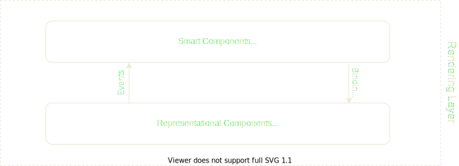

# Angular Composition Patterns

---

## Best Practice Representational Components

----



----

### Rule 1: Small Building Blocks

1. Single Responsibility
2. Simple APIs
3. High Flexibility

Note:
- Representational UI componens should only serve one purpose
- Complex gatekeeping components limit reusability

----

### Rule 2: Strict Component APIs

1. Simple & Clear APIs 
2. Stability by internal structure abstraction
3. DOM & CSS shouldn't be exposed

Note:
- Representational Components should expose a simple yet clear API
- Includes properties and outputs but could also include DOM structure and CSS styling
- Styling should also be handled in an explicit abstract manner to keep HTML and CSS independent from component API

----

### Rule 3: Strict Data Flow

1. Only pass primitive values as inputs
2. Only communicate with events as outputs
3. Don't mutate the inputs

Note:
- Bidirectional data flow between component and parents needs to be streamlined to improve reusability
- You should only pass through primitive data structures as inputs and communicate back with events
- Prevent side effects by mutating input data in the component

----

### Rule 4: Native Before Custom

1. Familiar APIs
2. Simple Implementation
3. Native Browser Support

Note:
- Custom Elements should only be used if there isn't a native solution in place
- If a native element is part of the building block it should be considered to expose it

---

## Angular Composition Techniques

----

### Directives + HostBinding

```typescript
@Directive({selector: '[ngModel]'})
class NgModelStatus {
  constructor(public control: NgModel) {}
  @HostBinding('class.valid') get valid() { 
    return this.control.valid; 
  }
  @HostBinding('class.invalid') get invalid() { 
    return this.control.invalid; 
  }
}
```

----

### Directives + HostBinding

<div class="compare-list">
    <ul class="pros">
        <li>Single responsibility</li>
        <li>Simple APIs</li>
    </ul>
    <ul class="cons">
        <li>No template composition</li>
    </ul>
</div>

----

### Content Projection

```html
<div class="example-container-component">
    <ng-content select="[slot='one']"></ng-content>
    <ng-content select=".two"></ng-content>
    <ng-content></ng-content>
</div>
```

```html
<container-component>
    <p slot="one">Content For Slot one</p>
    <p class="two">Content For Slot two</p>
    <p>Content for default</p>
</container-component>
```

----

### Content Projection

<div class="compare-list">
    <ul class="pros">
        <li>Template Composition</li>
        <li>Easy access to other components</li>
        <li>Context sensitive use cases</li>
    </ul>
    <ul class="cons">
        <li>No behaviour composition</li>
    </ul>
</div>

----

### Class Inheritance

```typescript
class RootComponent {
  @Input() title: string;
  highlight = false;

  click() {
    this.highlight = true;
  }
}
```

```typescript
class ExampleComponent extends RootComponent {}
```

----

### Class Inheritance

<div class="compare-list">
    <ul class="pros">
        <li>Behaviour extension</li>
        <li>Template extension</li>
    </ul>
    <ul class="cons">
        <li>Limit reusability</li>
        <li>Limit to one inheritance</li>
    </ul>
</div>

----

### Higher Order Components

```typescript
export function withStyle(style: { [key: string]: string }) {
  return (def) => {
    const originalFactory = def.ngComponentDef.factory;
    def.ngComponentDef.factory = () => {
      const cmp = originalFactory(def.ngComponentDef.type);
      cmp.style = css([style]);

      return cmp;
    };

    return def;
  };
}
```

----

### Higher Order Components

```typescript
@withStyle({
  background: "red"
})
@Component({
  selector: "component-example",
  templateUrl: "./example.component.html"
})
export class ExampleComponent {}
```

----

### Higher Order Components

<div class="compare-list">
    <ul class="pros">
        <li>Highly extensible</li>
        <li>Behaviour composition</li>
    </ul>
    <ul class="cons">
        <li>No template composition</li>
        <li>Advanced use cases</li>
    </ul>
</div>

---

## Angular Limitations

----

### Custom Elements

```html
<example-component>
    <h1>Hello World</h1>
    <p>Lorem ipsum dolor set amet</p>
</example-component>
```

----

### Custom Elements

- Enables styling encapsulation
- Do have a representation in dom
- Might conflict with css selectors

----

### Attribute Delegation

```html
<example-component>
    <another-custom-component class="my-custom-class">
    </another-custom-component>
</example-component>
```

----

### Attribute Delegation

- No attribute delegation
- Needs to be declared for each attribute

----

### Change Detection

```typescript
@Component({
  ...,
  template: '{{ count$ | async }}',
  changeDetection: ChangeDetectionStrategy.OnPush 
  // vs. ChangeDetectionStrategy.Default
})
export class ChangeDetectionComponent implements OnInit {
  count$: Observable<number>;
  ngOnInit() {
    this.count$ = interval(1000)
        .pipe(
            map((count: number) => ++count)
        );
  }
}
```

----

### Change Detection

- Default is triggered by every interaction with the browser
- Could lead to imperformant applications
- Representational components benefit from manual detection checks

Note:
- Input reference of the component changes
- DOM Event within a component has been dispatched (ex. click)
- Emission of an observable event subscribed with Async pipe
- change detection is manually run

---

## Live Example

---

## Follow Up

- [The Principles for Writing Awesome Angular Components](https://dev.to/gc_psk/the-principles-for-writing-awesome-angular-components-2ofi)
- [Angular Layout Composition the complete guide](https://dev.to/imm9o/angular-content-projection-the-complete-guide--3dcb)
- [Composing Angular Components with Typescript Mixins](https://blog.bitsrc.io/composing-angular-components-with-typescript-mixins-31e3833560f7)
- [OnPush change detection for faster Angular apps](https://itnext.io/onpush-change-detection-for-faster-angular-apps-f5d6dccea589)

<style>
.compare-list {
    display: flex; 
    text-align: left; 
    font-size: 32px;
    justify-content: space-around;
}

.pros, .cons {
  list-style: none !important;
  padding: 0;
  margin: 0 !important;
}

.pros li, .cons li {
    padding-left: 2rem;
    text-indent: -2.2rem;
    line-height: 2.5rem;
}

.pros li::before {
    content: "✅  ";
}

.cons li::before {
    content: "❌  ";
}
</style>