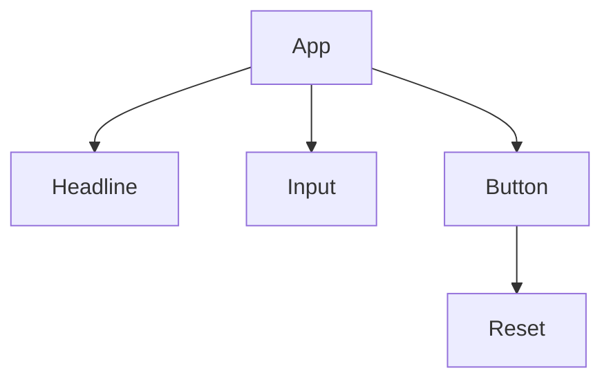

---
mermaid:
  themeVariables:
    primaryColor: '#fab700'
    primaryTextColor: '#fff'
    primaryBorderColor: '#7C0000'
    lineColor: '#F8B229'
    secondaryColor: '#006100'
    tertiaryColor: '#fff'
---

# Frontend Rendering

## Component Frameworks by Example

<div class="logos-background">
  
  
  
  
  
  
</div>

Note:
- Backbone of the modern JavaScript ecosystem
- One of the key enabler that allows very complex applications
- A lot of innovation happened, dozens of frameworks appeard
- Core idea didn't changed in the last 15 years
- They provide an excellent developer experience
- I will try to give you some insights about two very different frameworks and how they work
- What can we learn from this, can this inspire our UI frameworks

---

# Contents

1. Demo Application
2. About Components
3. React by Example
4. Svelte by Example
5. Conclusion

---

## Demo Application

----

<iframe src="http://localhost:8080" />

Note:
- Very simple App with some edge cases
- Headline can be changed on input change
- If the input is empty the default headline should be shown
- Finally a button can reset to the initial state (input and headline)

----

### Example (HTML)

```html
<div class="app">
  <h1 class="title" id="title">A Simple Example</h1>
  <input type="text" id="input-field" class="input-field" />
  <button id="action-button" class="action-button">
    Reset
  </button>
</div>

<script src="./script.js" type="module"></script>
<link href="./style.css" rel="stylesheet" />
```

----

### Example (JS)

```javascript
const title = document.getElementById('title');
const inputField = document.getElementById('input-field');
const actionButton = document.getElementById('action-button');

const defaultTitle = title.innerText;

const resetTitle = () => {
  title.innerText = defaultTitle;
};

inputField.addEventListener('input', (event) => {
  title.innerText = event.target.value;

  if (event.target.value === '') {
    resetTitle();
  }
});

actionButton.addEventListener('click', () => {
  resetTitle();
  inputField.value = '';
});

```

----

### Issues

- Reusability / Composability
- Scalability
- Consistency
- Maintenance
- Developer Experience

Note:
- Indirect coupling of HTML, CSS, JavaScript
- Reusing existing building blocks not possible
- Adding functionality hard since the tight coupling
- By reusing building blocks styling and behaviour will be identical
- Clunky JavaScript DOM API, CSS side effects, state isolation
- Keeping and managing application state
- Limited ability to create larger and more complex applications

---

## About Components

----

> Components are reusable building blocks of user interfaces that enpacsualte and abstract templating, logic and styling. They enable more complex applications by handling ui state updates.

----

### Example (PSEUDO)

```jsx
import Headline from './Headline';
import Input from './Input';
import Button from './Button';

function App({ title }) {
  let currentTitle = title;
  let inputValue = title;

  const updateTitle = (value) => currentTitle = value;
  const reset = () => {
    currentTitle = title;
    inputValue = '';
  }

  return <div class="app">
    <Headline title={ currentTitle } /> 
    <Input value={ inputValue } onChange={ updateValue } />
    <Button onCLick={ reset }>Reset</Button>
  </div>
}
```

Note:
- JavaScript is the main driver of a component
- Any native DOM element can be part of a component
- Encapsualtes Template, Logic and Style and provides a consistent interface to compose components
- Component Definition is also used for composition

----

### Component Usage

```jsx
<App title="A Simple Example" />
```

----

### Props

```jsx
<Headline 
  title={ currentTitle }  // <===
/> 
```

Notes:
- Properties of a component that expose it's attributes
- Can be anything from a simple boolean to a complex object
- Can only be set by the parent

----

### Event Handlers


```jsx
<Input 
  value={ inputValue } 
  onChange={ updateValue } // <===
/>
```

Notes:
- Automatic bindings to native DOM Apis (onclick, onChange, ....)
- Event emitting is only possible from child to parent
- Depending on the framework implemented as events or callbacks

----

### Children

```jsx
<Button onCLick={ reset }>
Reset {/* <=== */}
</Button>
```

Notes:
- Key to composition
- Any Dom Element or Text can be a child
- Most Frameworks also allow multiple portals (slots)

----

### State

```jsx

function App({ title }) {
  let currentTitle = title; // <== State
  let inputValue = title; // <== State

  const updateTitle = (value) => currentTitle = value; // <== Update State
  const reset = () => {
    currentTitle = title; // <== Update State
    inputValue = ''; // <== Update State
  }
}
```

Note:
- The Component needs to be somehow updated once the component state changes
- Most Component Frameworks define the same building blocks
- The difference is mostly in how they will establish reactivity

---

## React by Example


Notes:
- OG of pure component frameworks since 2011 and one of the most popular frameworks
- Core rendering idea is still the same
- Most of the refactorings since 2011 spent in better API for developers to enhance composability
- We will have a look how a React component looks like and how the reactivity works

----

<iframe src="http://localhost:3000"  />

----

### Example (React App)

```jsx
import { useEffect, useState } from 'react';
import './App.css';
import Headline from './components/headline/Headline';
import Input from './components/input/Input';
import Button from './components/button/Button';

const defaultTitle = 'React Example';

function App() {
  const [title, setTitle] = useState(defaultTitle);
  const [inputValue, setInputValue] = useState('');

  useEffect(() => {
    if (inputValue === '') {
      setTitle(defaultTitle)
    }
  }, [inputValue]);

  const changeHandler = (value) => {
    setTitle(value);
    setInputValue(value);
  }

  const reset = () => {
    setTitle(defaultTitle);
    setInputValue('');
  }

  return (
    <div className="app">
      <Headline title={title} />
      <Input value={inputValue} onChange={changeHandler} />
      <Button onClick={reset}>Reset</Button>
    </div>
  );
}

export default App;
```

----

### Example (React Input)

```jsx
import './Input.css';

function Input({ value, onChange }) {
  const changeHandler = (event) => onChange(event.target.value);

  return <input type="text" value={value} className="input-field" onChange={changeHandler} />
}

export default Input;

```

----

### Recap: Vanilla State Updates

```javascript
const defaultTitle = title.innerText;

const resetTitle = () => {
  title.innerText = defaultTitle; // <===
};

inputField.addEventListener('input', (event) => {
  title.innerText = event.target.value;  // <===

  if (event.target.value === '') {
    resetTitle();
  }
});

actionButton.addEventListener('click', () => {
  resetTitle();
  inputField.value = ''; // <===
});

```

Note:
- Real DOM Apis abstracted
- The Framework could simply rerender the whole app on each state change, that would lead to performance and UI issues (like inputs losing focus etc.)

----

### State Changes

```jsx
function App() {
  const [title, setTitle] = useState(defaultTitle); // <== State Container
  const [inputValue, setInputValue] = useState(''); // <== State Container

  useEffect(() => {
    if (inputValue === '') {
      setTitle(defaultTitle) // <== state change
    }
  }, [inputValue]);

  const changeHandler = (value) => {
    setTitle(value); // <== state change
    setInputValue(value); // <== state change
  }

  const reset = () => {
    setTitle(defaultTitle); // <== state change
    setInputValue(''); // <== state change
  }

  return (
    <div className="app">
      <Headline title={title} />
      <Input value={inputValue} onChange={changeHandler} />
      <Button onClick={reset}>Reset</Button>
    </div>
  );
}
```
Note:
- Component updates are triggered vial state changes
- Different APIs available, for example `useState`
- How get's the dom updated, previously we had to implement the changes ourself

----

### DOM Tree



Note:
- First of all A typical DOM representation of our UI would look like this
- React uses JSX to create a data representation

----

### DOM Fiber


Note:

- React abstracts the DOM structure into a data structure they call Fiber
- This fiber is hold in memory and is a classic tree implementation, this is the virtual DOM

----

### Recouncilation


Note:
- Every state modifier will lead to a process called recouncilation
- Components that changed their state will be computed in memory (inculding their children)
- The changes are diffed and patched to the real DOM


---

## Svelte by Example


Note:
- Since 2016
- Uses a different approach: compiles to native JavaScript
- Most of the APIs look and feel very identical to native JavaScript
- Heavy lifting is done on compile level

----

<iframe src="http://localhost:5173" />

----

### Example (Svelte App)

```html
<script>
  import Headline from './components/Headline.svelte';
  import Input from './components/Input.svelte';
  import Button from './components/Button.svelte';
  const defaultTitle = 'A Svelte Example';

  let title = defaultTitle;
  let inputValue = '';

  const changeHandler = ({ detail }) => {
    title = detail.value;
    inputValue = detail.value;
  };

  const reset = () => {
    title = defaultTitle;
    inputValue = '';
  };

  $: {
    if (inputValue === '') {
      title = defaultTitle;
    }
  }
</script>

<div class="app">
  <Headline {title} />
  <Input value={inputValue} on:change={changeHandler} />
  <Button on:click={reset}>Reset</Button>
</div>

```

----

### Example (Svelte Input)

```html
<script>
  import { createEventDispatcher } from 'svelte';
  export let value = '';
  const dispatch = createEventDispatcher();

  function changeHandler(event) {
    dispatch('change', { value: event.target.value });
  }
</script>

<input type="text" {value} class="input-field" on:input={changeHandler} />
```

----

### Reactivity

```javascript
let title = defaultTitle; // <== state change
let inputValue = ''; // <== state change

const changeHandler = ({ detail }) => {
  title = detail.value; // <== state change
  inputValue = detail.value; // <== state change
};

const reset = () => {
  title = defaultTitle; // <== state change
  inputValue = ''; // <== state change
};

$: {
  if (inputValue === '') {
    title = defaultTitle; // <== state change
  }
}
```

Note:
- Real DOM Apis abstracted but feels like a native API
- Again: How get's the dom updated, previously it looks like vanillaJS but it is reactive

----

### How the Compiler works

```html
<script>
  export let title = '';
</script>
<h1 class="title">{ title }</h1>
```
Note:
- Compiler parses all .svelte files and parses the different parts

----

### Transforming HTML

```html
<h1 class="title">{ title }</h1>
```

```javascript
{
  nodeName: 'h1',
  tagName: 'h1',
  attrs: [ { name: 'class', value: 'title' } ],
  namespaceURI: 'http://www.w3.org/1999/xhtml',
  childNodes: [
    {
      nodeName: '#text',
      value: '{ title }',
      parentNode: ...
    }
  ] 
}
```

Note:
- HTML is parsed and represented as a data structure

----

### Transforming JavaScript

```javascript
export let title = '';
```

```javascript
{
  type: "ExportNamedDeclaration",
  start: 0,
  end: 22,
  declaration: {
    type: "VariableDeclaration",
    start: 7,
    end: 22,
    declarations: [
      {
        type: "VariableDeclarator",
        start: 11,
        end: 21,
        id: {
          type: "Identifier",
          start: 11,
          end: 16,
          name: "title"
        },
        init: {
          type: "Literal",
          start: 19,
          end: 21,
          value: "",
          raw: "''"
        }
      }
    ],
    kind: "let"
  },
  specifiers: [],
  source: null
}
```

Note:
- JavaScript is parsed as an AST and afterwards compiled to create SveltJeComponents

----

### Compiled output

```javascript
function create_fragment$4(ctx) {
  let h1;
  let t;
  return {
    c() {
      h1 = element("h1");
      t = text(
        /*title*/
        ctx[0]
      );
      this.h();
    },
    h() {
      attr(h1, "class", "title svelte-y7wc25");
    },
    // ...
  };
}
```

Notes:
- Same is done for every Component
- Again: There is no virtual dom or any kind of runtime diffing in place, everything is generated statically
- It will always outperform Virtual DOM since the there is no comparison to the current state needed to do partial updates

---

## Conclusion

1. The idea of UI building blocks didn't changed in the last 15 years
2. Simple and clear component APIs enable scaling and reusability by decoupling
3. Using markup as a composition layer is powerfull
4. Abstracting ui updates via reactivity enables developers to create more complex interfaces
5. Static code creation on build time seems promising 
